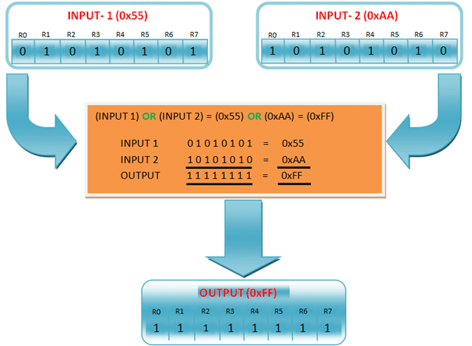

# Harvard Arcitecture  

## What is Harvard Arcitecture ?  

Harvard architecture is a computer system design that separates the memory and  
pathways for data and instructions, enabling faster processing and enhanced  performance.  Its significance lies in its ability to fetch both  instructions and data simultaneously, thus improving the efficiency of computers, particularly in digital signal processing and microcontroller applications.

## What are the benefits of Harvard Arcitecture ?  

Harvard architecture is a computer system design that separates the memory and pathways for data and instructions, enabling faster processing and enhanced performance.  Its significance lies in its ability to fetch both instructions and data simultaneously, thus improving the efficiency of computers, particularly in digital signal processing and microcontroller applications. 


## How does this work ??

In a normal computer that follows von Neumann architecture, instructions, and data both are stored in the same memory. So same buses are used to fetch instructions and data. This means the CPU cannot do both things together (read the instruction and read/write data). Harvard Architecture is the computer architecture that contains separate storage and separate buses (signal path) for instruction and data. It was basically developed to overcome the bottleneck of Von Neumann’s Architecture. The main advantage of having separate buses for instruction and data is that the CPU can access instructions and read/write data at the same time. 

  

## What is RISC  Architecture ??  
RISC stands for Reduced Instruction Set Computer and is a type of architectural processor design strategy. “Architecture” refers to the way a processor is planned and built and can refer to either the hardware or the software that is closest to the silicon on which it runs

## Overview of the atmel 328P 
The high-performance Microchip picoPower 8-bit AVR RISC-based microcontroller combines 32KB ISP flash memory with read-while-write capabilities, 1024B EEPROM, 2KB SRAM, 23 general-purpose I/O lines, 32 general purpose working registers, three flexible timer/counters with compare modes, internal and external interrupts, serial programmable USART, a byte-oriented 2-wire serial interface, SPI serial port, a 6-channel 10-bit A/D converter (8-channels in TQFP and QFN/MLF packages), programmable watchdog timer with internal oscillator, and five software selectable power saving modes. The device operates between 1.8-5.5 volts.

By executing powerful instructions in a single clock cycle, the device achieves throughputs approaching 1 MIPS per MHz, balancing power consumption and processing speed.

Harvard architecture has two separate buses for instruction and data. Hence, the CPU can access instructions and read/write data at the same time. This is the major advantage of Harvard architecture. 

In practice, Modified Harvard Architecture is used where we have two separate caches (data and instruction). This is common and used in X86 and ARM processors.

## Types of buses used  and what are they ?


Buses are used as signal pathways. In Harvard architecture, there are separate buses for both instruction and data.  


Data Bus: It carries data among the main memory system, processor, and I/O devices. 


Data Address Bus: It carries the address of data from the processor to the main memory system. 
    
Instruction Bus: It carries instructions among the main memory system, processor, and I/O devices. 

Instruction Address Bus: It carries the address of instructions from the processor to the main memory system. 


## What is so special about Atmel Mcu's

AVR is an 8-bit microcontroller belonging to the family of Reduced Instruction Set Computer (RISC). In RISC architecture the instruction set of the computer are not only fewer in number but also simpler and faster in operation.


We will explore more on this when we will learn about the architecture of AVR microcontrollers in following section.


## What is  meant by 8-bit?   

This means that the microcontroller is capable of transmitting and receiving 8-bit data. The input/output registers available are of 8-bits. 

The AVR family controllers have register based architecture which means that both the operands for an operation are stored in a register and the result of the operation is also stored in a register. Following figure shows a simple example performing OR operation between two input registers and storing the value in Output Register.


Block Diagram Showing Simple Example Carrying Out OR Operation Between Two Input Registers And Value Storage  
in Output Register  

  

Architecture Diagram of Atmel  devices in general   


## Read the datasheet  

Most of you understanding of Mcu's will come from the datasheet. Dont worry if you dont understand all of this in  one go 
I will guide you through the most important starting points  as i go through this  step by step  
The important parts to get to grips with  are drawing yourself a flow  chart as coding and seeing where  you go wrong  shows up  
easily.  Hence the flow chart  on the initial README.MD  file 

Here is the link to the datasheet 

[Datasheet for Atmel 328P](../../Notes/Atmel-7810-Automotive-Microcontrollers-ATmega328P_Datasheet.pdf) 

## The code used in lesson1  

The aim is simply to  get the  Mcu to output a a value to portd pin 4 

```


#include "lesson1.h"

#define F_CPU 16000000
#define LED PD4  // Change LED to be PD4

int main(void) {
    DDRD |= (1 << LED);  // Configure PORTB0 (PD4) as output 
    
    PORTD |= (1 << LED); // Set PD4 high (LED on)

    while(1) {
        // Your code here (this loop will run indefinitely)
    }

    return 0;
}


```

## Lets break the code down  and see what this is doing 

```
#include "lesson1.h"
```
This line includes a header file named "lesson1.h". Header files typically contain declarations of functions, macros, constants, etc., that are used in the program.

## Where does lesson1.h  come from  ?

This is contained in the Header_files Directory  and has this code within This is simply the headers that it needs 
header files in C serve as a means of organizing code, providing function prototypes and shared declarations, promoting modularity, and facilitating code reuse.  
They are essential in large projects and contribute to writing clean and maintainable C programs
Code contained in lesson1.h 

## Why code using header files   

A header file is a file containing C declarations and macro definitions (see Macros) to be shared between several source files. You request the use of a header file in your program by including it, with the C preprocessing directive ‘#include’.

Header files serve two purposes.

System header files declare the interfaces to parts of the operating system. You include them in your program to supply the definitions and declarations you need to invoke system calls and libraries.
Your own header files contain declarations for interfaces between the source files of your program. Each time you have a group of related declarations and macro definitions all or most of which are needed in several different source files, it is a good idea to create a header file for them. 

Including a header file produces the same results as copying the header file into each source file that needs it. Such copying would be time-consuming and error-prone. With a header file, the related declarations appear in only one place. If they need to be changed, they can be changed in one place, and programs that include the header file will automatically use the new version when next recompiled. The header file eliminates the labor of finding and changing all the copies as well as the risk that a failure to find one copy will result in inconsistencies within a program.

In C, the usual convention is to give header files names that end with .h. It is most portable to use only letters, digits, dashes, and underscores in header file names, and at most one dot. 

``` 
#include <avr/io.h>
#include <avr/interrupt.h>

```
For more indepth detail see the following link  regards header files 

https://gcc.gnu.org/onlinedocs/cpp/Header-Files.html


