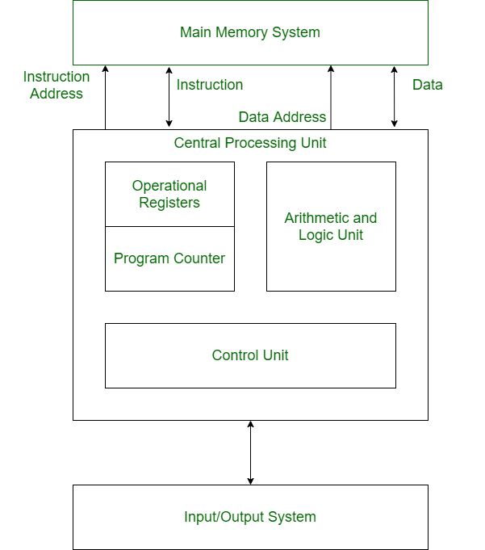
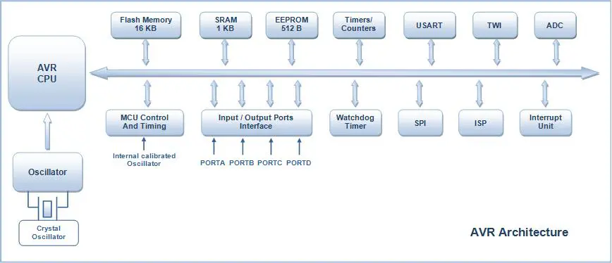

# Harvard Arcitecture  

## What is Harvard Arcitecture ?  

Harvard architecture is a computer system design that separates the memory and  
pathways for data and instructions, enabling faster processing and enhanced  performance.  Its significance lies in its ability to fetch both  instructions and data simultaneously, thus improving the efficiency of computers, particularly in digital signal processing and microcontroller applications.

## What are the benefits of Harvard Arcitecture ?  

Harvard architecture is a computer system design that separates the memory and pathways for data and instructions, enabling faster processing and enhanced performance.  Its significance lies in its ability to fetch both instructions and data simultaneously, thus improving the efficiency of computers, particularly in digital signal processing and microcontroller applications. 

## How does this work ??

In a normal computer that follows von Neumann architecture, instructions, and data both are stored in the same memory. So same buses are used to fetch instructions and data. This means the CPU cannot do both things together (read the instruction and read/write data). Harvard Architecture is the computer architecture that contains separate storage and separate buses (signal path) for instruction and data. It was basically developed to overcome the bottleneck of Von Neumann’s Architecture. The main advantage of having separate buses for instruction and data is that the CPU can access instructions and read/write data at the same time. 

  

## What is RISC  Architecture ??  
RISC stands for Reduced Instruction Set Computer and is a type of architectural processor design strategy. “Architecture” refers to the way a processor is planned and built and can refer to either the hardware or the software that is closest to the silicon on which it runs

## Overview of the atmel 328P 
The high-performance Microchip picoPower 8-bit AVR RISC-based microcontroller combines 32KB ISP flash memory with read-while-write capabilities, 1024B EEPROM, 2KB SRAM, 23 general-purpose I/O lines, 32 general purpose working registers, three flexible timer/counters with compare modes, internal and external interrupts, serial programmable USART, a byte-oriented 2-wire serial interface, SPI serial port, a 6-channel 10-bit A/D converter (8-channels in TQFP and QFN/MLF packages), programmable watchdog timer with internal oscillator, and five software selectable power saving modes. The device operates between 1.8-5.5 volts.

By executing powerful instructions in a single clock cycle, the device achieves throughputs approaching 1 MIPS per MHz, balancing power consumption and processing speed.

Harvard architecture has two separate buses for instruction and data. Hence, the CPU can access instructions and read/write data at the same time. This is the major advantage of Harvard architecture. 

In practice, Modified Harvard Architecture is used where we have two separate caches (data and instruction). This is common and used in X86 and ARM processors.

## Types of buses used  and what are they ?

Buses are used as signal pathways. In Harvard architecture, there are separate buses for both instruction and data.  

Data Bus: It carries data among the main memory system, processor, and I/O devices. 

Data Address Bus: It carries the address of data from the processor to the main memory system. 
    
Instruction Bus: It carries instructions among the main memory system, processor, and I/O devices. 

Instruction Address Bus: It carries the address of instructions from the processor to the main memory system. 

## What is so special about Atmel Mcu'same  

AVR is an 8-bit microcontroller belonging to the family of Reduced Instruction Set Computer (RISC). In RISC architecture the instruction set of the computer are not only fewer in number but also simpler and faster in operation.

We will explore more on this when we will learn about the architecture of AVR microcontrollers in following section.

## What is 8-bit?   

This means that the microcontroller is capable of transmitting and receiving 8-bit data. The input/output registers available are of 8-bits. 

The AVR family controllers have register based architecture which means that both the operands for an operation are stored in a register and the result of the operation is also stored in a register. Following figure shows a simple example performing OR operation between two input registers and storing the value in Output Register.

Block Diagram Showing Simple Example Carrying Out OR Operation Between Two Input Registers And Value Storage In Output Register

## Read the datasheet 

