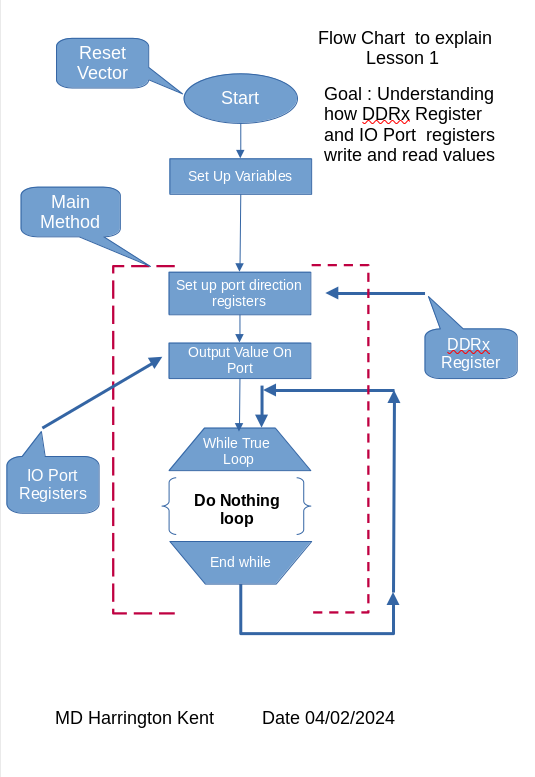
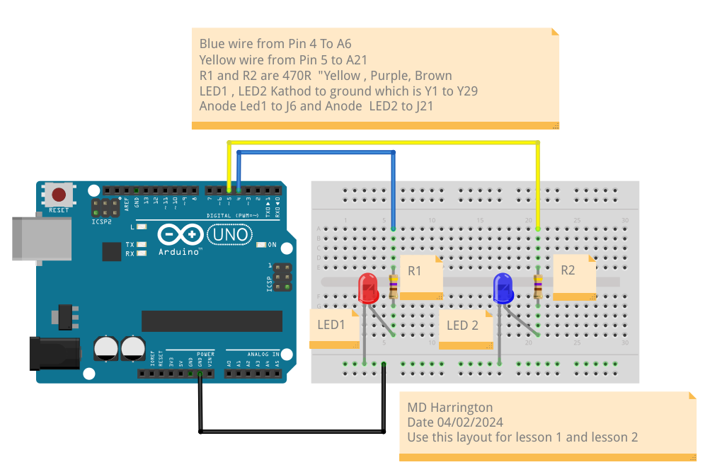
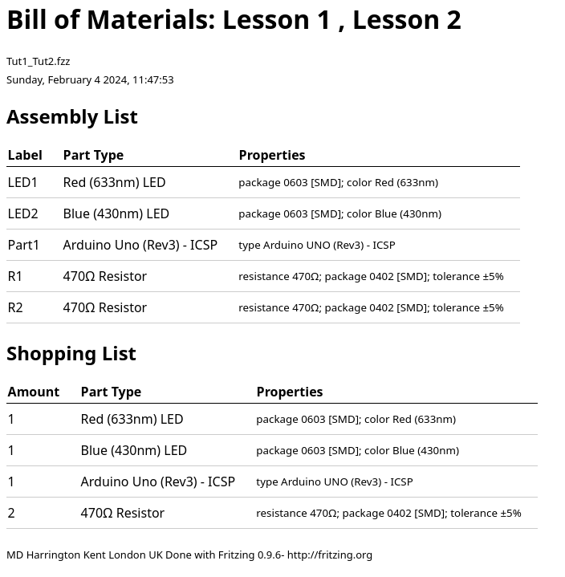

# Make File For Atmel Cpu MD Harrington Kent 
## Date 03/02/2024

## Initial  diagrams / Drawings you will need to follow this

Diagram of Uno Development Board 


Diagram of Atmel 328P Pin out  


## Purpose of make file and what this does  
Makefiles are used to help decide which parts of a large program need to be recompiled. In the vast majority of cases, C or C++ files are compiled. Makefile  can be used to do many tasks other than just compile.  It can be used to preform stick standard bash tasks  well


The  Project includes  the following files   
A directory named C_Files and Directory named Header_files also 
the makefile  itself which is used to  compile the C  and header files to upload  
to the atmel  device 
  
The makefile  contains the following commands 

1: make  , this compliles all c  and header  files in the directories  named C_Files   && Header_files directories under Lesson1 producing the following files main.hex, main.elf, main.o, main , and main.s

2: make burn , this uploads the hex file to the Mcu using arduino ports  

3: make clean ,this uses basic  bash commands to remove all files in compilation   
apart from  any c files and header files contained in directories meantioned above 

4: To change the compilation to Lesson2  then  edit the make file lines 1 and 2  
This $(wildcard Lesson1/C_Files/*.c)  

should then be changed to   

$(wildcard Lesson2/C_Files/*.c)

The same applies to $(wildcard Lesson1/Header_Files/*.h)

This  should be changed to 

$(wildcard Lesson2/Header_Files/*.h)


## Installation

Install of source code to local drive 

```bash
   ## Assumning git installed  run  git clone < address of git repository >
   git clone git@github.com:markh2016/MakeFileForAtmelCpu.git
      
   ## cd in to  cloned directory 
   cd MakeFileForAtmelCpu
   
   ## now run make  from the command line 
   make 
   
   ## connect arduino , hopefully you wont have to modify port in ***Makefile***
   ## to upoad hex  from terminal run the command  make burn
   make burn 
   
   ## To clean the project  use the command from terminal ***make clean*** 
   ##  See below  this line  as how to 
   make clean 

```
    
# Features

## Here's a breakdown of what each part of the Makefile does:
```
target = main:   
Specifies the name of the output file.  

src_files = $(wildcard Lesson1/C_Files/*.c):   
Collects all C source files in the Lesson1/C_Files directory.  

header_files = $(wildcard Lesson1/Header_Files/*.h):   
Collects all header files in the Lesson1/Header_Files directory.

cpu_type = atmega328p:   
Specifies the default CPU type.  


.PHONY: all burn clean:   
Declares the all, burn, and clean targets as phony, meaning they are not actual files but rather targets for the Makefile.  

all: The default target. Depends on $(target).hex, $(target).elf, and $(target).s.

$(target).s: Generates assembly code from the source files.  

$(target).o: Compiles the source files into object files.  

$(target): Links the object files into an executable.

$(target).hex: Converts the executable into a hex file.

$(target).elf: Converts the executable into an ELF file.

burn: Flash the hex file to the AVR microcontroller using avrdude.

clean: Removes all generated files.

This Makefile assumes that you have the AVR toolchain (avr-gcc, avr-objcopy, avrdude) installed and configured correctly on your system, and that you have an AVR microcontroller connected to /dev/ttyUSB0.

```
## A more comprehensive break down   of how this makefile works  line by line of code 

  
Sets the variable target to "main", which represents the name of the main target file without the file extension.  

  
Uses wildcard function to find all the C source files (*.c) in the source directory and assigns them to src_files.
Uses patsubst function to replace the .c extension with .o for each source file and assigns them to obj_files.  
This creates a list of corresponding object files.

  

Sets the variable cpu_type to specify the type of AVR microcontroller being used, in this case, it's atmega328p.

  

Sets the variables CC, OBJCOPY, and AVRDUDE to the commands for compiling (avr-gcc), object copying (avr-objcopy), 
and AVR programming (avrdude) respectively.  

  
Sets the CFLAGS variable which contains compiler flags:

    -I$(hdr_dir): Specifies the directory to search for header files.
    -mmcu=$(cpu_type): Specifies the AVR microcontroller type.
    -Os: Optimization flag for size.

  
Defines the default target all which depends on generating .hex, .elf, and .s files.  

  
Generates assembly code .s file from source files using the avr-gcc command.

  
Compiles each .c file in the source directory into an object file using avr-gcc.  

  
Links object files into the final target executable using avr-gcc.  

  
Converts the target executable into Intel HEX format using avr-objcopy.  

  
Converts the target executable into ELF format using avr-objcopy.  

  
Defines a target burn to upload the .hex file onto the AVR microcontroller using avrdude.  

  
Defines the clean target to remove all generated files and object files.


## Diagrams you will need  to follow this 
An excellent presentation  explaining the memory map with assember for the   
Atmel devices 

[MCU-Part03.pdf](https://github.com/markh2016/AVR-gcc-Lessons/files/14155371/MCU-Part03.pdf)  

Flow Charts For Lesson 1  
  

The Layout showing how  you would link the components to the breadboard  with arduino



Parts List for the Lesson 1 and Lesson2 
 

<!--- Comments are Fun [a relative link](other_file.md) --->


